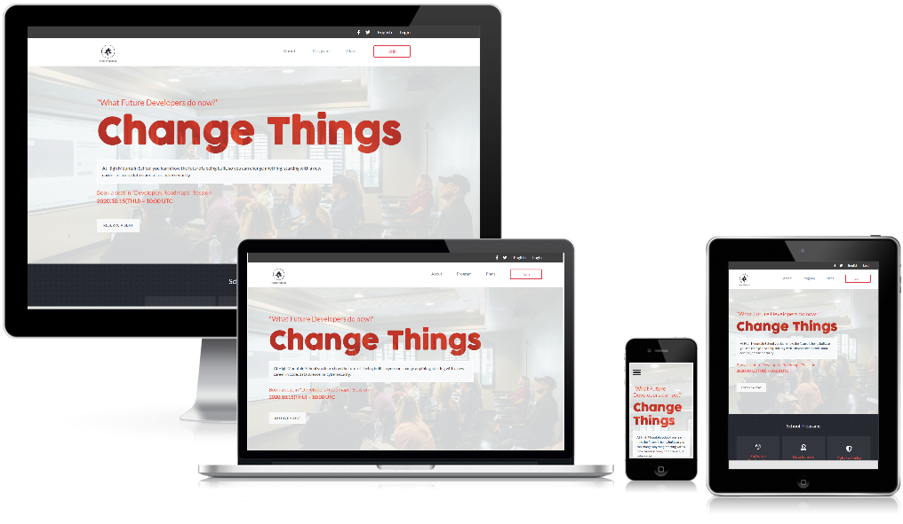
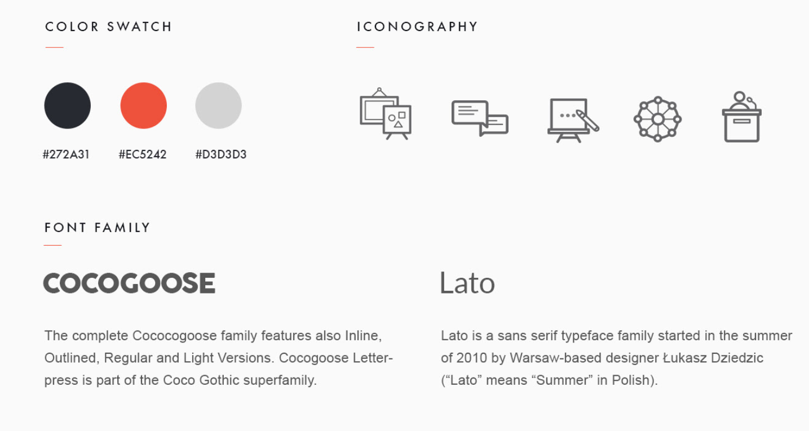
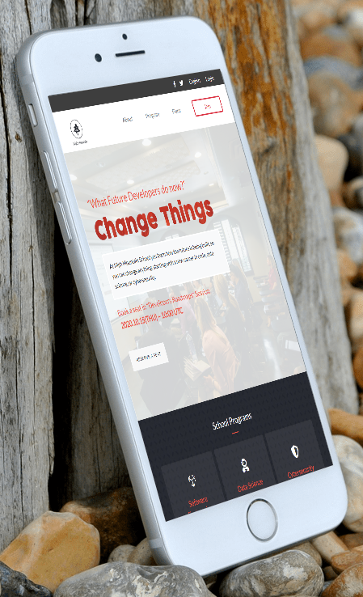

Give a ⭐️ if you like this project!  

# HTML/CSS Capstone Project : High Mountain Online Bootcamp

 _High Mountain Online Bootcamp is an online-based school teaching a wide variety of Software Engineering tracks._

 ## 🛠 Colors and Typograph :

## 📺 Live Demo 

[High Mountain School](https://od-c0d3r.github.io/highmount/)

## 📡 Technologies used :

- HTML & CSS
- Bootstrap 4 ~ _For positing pages elements_
- Flexbox & Media queries ~ _Some elements visibilty control_
- SASS ~ _Organizing CSS file_

## 🛠 Tools used :

1. [Trello](http://trello.com) -  _Task and time managment_
1. [CreateMockup](http://createmockup.com) - _Resposive screenshots_
1. [VSCode](https://code.visualstudio.com/) - _As a code editor_
1. [Webhint](https://webhint.io/) & [Stylelint](https://stylelint.io/) - _Code testing_
1. [Google DevTools](https://developers.google.com/) - _Debugging tool_

## Getting Started

Follow these steps to get a local copy up and running :

1. Install `git` on your local machine.
1. Type `git init` in the Terminal.
1. Clone the repository to your local machine `git clone https://github.com/od-c0d3r/highmount.git`.
1. Cd into the repository `cd highmount`.
1. Open the `index.html` file and run it with your editor.

## 👤 Auther Omar R.

- 
- 

## Show your support

Give a ⭐️ if you like this project!

## Acknowledgments

- Design idea by [Cindy Shin in Behance](https://www.behance.net/adagio07)
- Daniel Zawadzki CodePen ~ _Cards effect_
- Erik Terwan CodePen ~ _Hamburger Menu_
- Byabasaija ~ _Custom border_ ~ [@Byabasaija](https://github.com/Byabasaija) 

## 📝 License

This project is [MIT](https://opensource.org/licenses/MIT) licensed.
